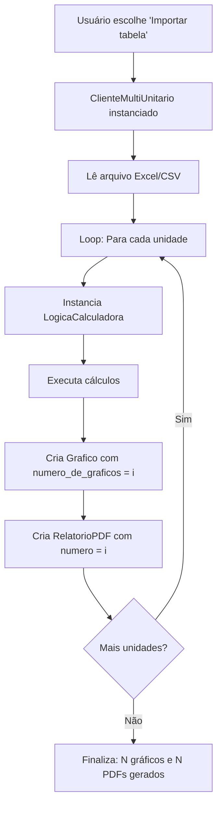

# Pesquisa: Sistema Simulador de Desconto - Mercado Livre de Energia

**Data**: 07 de Fevereiro de 2026
**Projeto**: Calculadora de Descontos do Mercado Livre de Energia

---

## 📋 Sumário Executivo

Este documento apresenta uma análise completa do sistema **Simulador de Desconto** para o mercado livre de energia elétrica no Brasil, incluindo sua arquitetura, funcionamento detalhado e comparação com soluções similares disponíveis no mercado.

---

## 🎯 Visão Geral do Sistema

### Objetivo
Simulador para calcular descontos e economia financeira ao migrar do mercado regulado de energia (ACR/Cativo) para o mercado livre (ACL) no Brasil. O sistema realiza cálculos financeiros complexos considerando tarifas, impostos, períodos contratuais e modalidades tarifárias específicas.

### Público-Alvo
- Comercializadoras de energia
- Empresas consultoras do setor elétrico
- Potenciais clientes do mercado livre
- Gestores de energia de grandes empresas

---

## 🏗️ Arquitetura e Componentes

### Estrutura de Arquivos

```
simulador_desconto/
├── LogicaCalculadora.py      # Motor de cálculo principal (803 linhas)
├── InterfaceVisual.py         # Interface gráfica PySimpleGUI
├── Grafico.py                 # Geração de gráficos matplotlib
├── RelatorioPDF.py           # Geração de relatórios PDF
├── bd_tarifario.xlsx         # Base de dados de tarifas
├── datas_rt.xlsx             # Datas de reajuste tarifário
├── ClienteMultiUnitario.py   # Processamento multi-unidades
└── README.md
```

---

## 🔧 Componentes Detalhados

### 1. LogicaCalculadora.py - Motor de Cálculo

**Localização**: `simulador_desconto/LogicaCalculadora.py`

#### Parâmetros de Entrada (linhas 11-33)

| Parâmetro | Tipo | Descrição |
|-----------|------|-----------|
| `demandaHPkW` | float | Demanda Horário de Ponta em kW |
| `demandaHFPkW` | float | Demanda Horário Fora de Ponta em kW |
| `consumoHPkWh` | float | Consumo HP em kWh |
| `consumoHFPkWh` | float | Consumo HFP em kWh |
| `aliquotaICMScativoC11` | float | Alíquota de ICMS (%) |
| `aliquotaPasepCofinsC12` | float | Alíquota PIS/COFINS (%) |
| `numenergiaC13` | float | Tipo de energia (i1/i5/i0) |
| `despesasCCEEC14` | float | Despesas CCEE |
| `numicmsQ3` | int | Tipo de tributação ICMS |
| `mes_inicio` / `ano_inicio` | int | Data início do contrato |
| `mes_fim` / `ano_fim` | int | Data fim do contrato |
| `taxaVPL` | float | Taxa para cálculo VPL (%) |
| `descontoGarantido` | float | Desconto garantido (%) |
| `vigenciacontrato` | list | Preços por ano (modo PD) |
| `fornecimentoN1` | string | Modalidade tarifária |
| `distribuidoraQ31` | string | Nome da distribuidora |
| `tipooferta` | int | 1=DG, 2=PD |

#### Processamento Principal (linhas 44-796)

**Etapa 1: Leitura de Dados Tarifários**
- **Linha 384**: Lê arquivo `bd_tarifario.xlsx` com pandas
- **Linha 401**: Lê arquivo `datas_rt.xlsx` com datas de reajuste
- **Linhas 390-392**: Filtra tarifas por distribuidora e modalidade

**Etapa 2: Construção de Tarifas Temporais**
- **Linhas 407-449**: Cria série temporal de tarifas por mês
- Considera mês de reajuste específico de cada distribuidora
- Gera 444 meses de projeção (37 anos: 2021-2057)

**Etapa 3: Cálculo ACR (Mercado Cativo)**
- **Linhas 488-500**: Calcula custos no mercado regulado
  - `fio_Cusd`: Custo de fio (TUSD) por MWh
  - `fio_PasepCofins`: Tributos PIS/COFINS sobre fio
  - `fio_ICMS`: ICMS sobre fio
  - `energia_CCER`: Custo de energia (TE)
  - `energia_PasepCofins`: Tributos sobre energia
  - `energia_ICMS`: ICMS sobre energia
  - `custo_TotalACR`: Custo total ACR (R$/MWh)

**Etapa 4: Cálculo ACL (Mercado Livre)**
- **Linhas 502-541**: Calcula custos no mercado livre
  - `fioACL_Cusd`: Custo de fio no ACL
  - `energianoCG_SemImposto`: Energia no contragarantia
  - `energianoCG_ComImposto`: Com impostos aplicados
  - `desconto_Energia`: Desconto calculado
  - `energiaACL_PrecoDeterminado`: Preço final energia
  - `custo_TotalACL`: Custo total ACL (R$/MWh)

**Etapa 5: Cálculo de Descontos**
- **Linha 549**: Calcula desconto mensal: `1 - (ACL/ACR)`
- **Linhas 552-618**: Calcula valores monetários absolutos

**Etapa 6: Agregação Anual com VPL**
- **Linhas 654-735**: Agrega valores mensais em anuais
- Usa `numpy_financial.npv()` para Valor Presente Líquido
- **Linha 428**: Taxa mensal VPL = `(1 + taxa_anual)^(1/12) - 1`
- Separa lógica para modo DG (linhas 666-701) e PD (linhas 704-735)

#### Saídas (linhas 797-803)

```python
def enviardadosparagrafico(self):
    return (
        montante_gasto_efetivamente_anual,  # Gasto ACL por ano
        montante_economizado_anual,         # Economia por ano
        anos_vigencia_contrato              # Anos do contrato
    )

def enviardadospararelatorio(self):
    return (
        desconto_geral_fornecimento,        # Desconto médio (%)
        montante_economizado_final,         # Economia total (R$)
        periodo_contrato                    # ["Mês/Ano", "Mês/Ano"]
    )
```

#### Distribuidoras Suportadas (linhas 222-250)

27 distribuidoras incluindo:
- CEMIG, CEBDIS, Celesc-DIS, CELPE, CEMIG PSR
- COELBA, COPEL, COSERN, CPFL-Paulista
- EDP ES, Enel CE, Enel GO, Enel SP
- ENERGISA MS, ENERGISA MT, ENERGISA PB
- EQUATORIAL PA, LIGHT
- Elektro, Enel RJ, EMG, AmE, CEEE-D, ENERGISA TO, RGE Sul (experimentais)
- Média Brasil

#### Modalidades Tarifárias (linhas 206-214)

- **A4 Azul**: Tarifação com ponta/fora-ponta
- **A4 Verde**: Tarifa única de demanda
- **AS Azul**: Alta tensão com ponta/fora-ponta
- **AS Verde**: Alta tensão com tarifa única
- **A2 Azul**: Muito alta tensão

---

### 2. InterfaceVisual.py - Interface Gráfica

**Localização**: `simulador_desconto/InterfaceVisual.py`
**Tecnologia**: PySimpleGUI

#### Estrutura da Interface

**Layouts Principais (linhas 14-124)**

1. **Layout Base** (linhas 127-132)
   - Escolha entre entrada visual ou importação de tabela
   - Botões para modo de operação

2. **Layout Desconto Garantido** (linhas 14-101, 115)
   - Frame de consumo do cliente
   - Frame de periodicidade do contrato
   - Frame de desconto garantido
   - Campos para nome e CNPJ do cliente

3. **Layout Preço Determinado** (linhas 42-113, 116)
   - Similar ao DG, mas com entrada de preços por ano
   - Campo para lista de preços separados por vírgula

#### Fluxo de Eventos (linhas 162-343)

```python
while True:
    event, values = window_visual_interface.read()

    if event == 'Desconto Garantido':
        # Exibe layout DG, oculta PD

    elif event == 'Preço Determinado':
        # Exibe layout PD, oculta DG

    elif event == 'Adicionar nome do cliente':
        # Armazena nome do cliente

    elif event == 'Upar dados de consumo':
        # Coleta dados de consumo e impostos
        # Converte strings para números

    elif event == 'Upar período de contrato':
        # Coleta datas e taxa VPL

    elif event == 'Upar dados de desconto':
        # Instancia LogicaCalculadora
        # Executa cálculos
        # Gera gráfico automaticamente

    elif event == 'Gerar relatório em PDF':
        # Instancia RelatorioPDF
        # Cria documento PDF final
```

#### Conversões de Dados (linhas 209-232)

**Tipo de Energia**:
- i1 → 0 (Convencional incentivada)
- i5 → 0.5 (50% incentivada)
- i0 → 1 (Não incentivada)

**Tipo ICMS**:
- NP → 1 (Não - Padrão)
- SP → 2 (Sim - ICMS Padrão)
- SNICMS → 3 (Sim - ICMS 0%)
- NNICMS → 4 (Não - Venda ACL Isenta ICMS)

---

### 3. Grafico.py - Geração de Visualizações

**Localização**: `simulador_desconto/Grafico.py`
**Tecnologia**: matplotlib

#### Estrutura do Gráfico (linhas 15-48)

**Tipo**: Gráfico de barras empilhadas verticais

**Componentes**:
1. **Barra Inferior** (linha 25)
   - Cor: RGB(0.078, 0.55, 0.455) - Verde escuro
   - Dados: `montante_gasto_efetivamente_anual`
   - Representa: Valor pago no ACL

2. **Barra Superior** (linha 26)
   - Cor: RGB(0.502, 0.780, 0.228) - Verde claro
   - Dados: `montante_economizado_anual`
   - Representa: Economia vs ACR
   - `bottom=montante_gasto_efetivamente_anual` (empilhamento)

**Formatação** (linhas 28-41):
- Eixo Y: Formato "R${valor}" com `mtick.StrMethodFormatter`
- Rótulos nas barras inferiores: rotação 90°, centralizados
- Rótulos nas barras superiores: rotação 60°, acima das barras
- Formato numérico brasileiro: "1.234,56"

**Exportação** (linhas 45-48):
```python
if numero_de_graficos == 0:
    fig.savefig('imagens/grafico_de_desconto_do_cliente_com_unidade_unica.png')
else:
    fig.savefig('imagens/grafico_de_desconto_da_unidade_' + str(numero) + '.png')
```

---

### 4. RelatorioPDF.py - Relatórios Profissionais

**Localização**: `simulador_desconto/RelatorioPDF.py`
**Tecnologia**: reportlab

#### Estrutura do Relatório (linhas 16-79)

**3 Páginas com Layouts Diferentes**:

**Página 1** (linhas 29-43):
- Template: `imagens/relatorio.png`
- Gráfico: Tamanho médio (73x55mm), posição (82, 21)
- Desconto: Fonte Helvetica 40pt, cor #148c73
- Economia: Fonte 18pt
- Período: Fonte 12pt, cor #158d74

**Página 2** (linhas 45-59):
- Template: `imagens/relatorio_2.png`
- Gráfico: Grande (140x59mm), centralizado (10, 21)
- Layout horizontal com informações lado a lado

**Página 3** (linhas 61-77):
- Template: `imagens/relatorio_3.png`
- Gráfico: Grande (140x59mm)
- Layout vertical com período em linhas separadas

#### Formatação de Dados (linhas 23-27)

```python
# Desconto: Converte decimal para percentual com 2 casas
dmc = str(round(float(desconto * 100), 2)).replace(".", ",")

# Economia: Formato brasileiro com vírgula
mef = str(round(float(economia), 2)).replace(".", ",")

# Período: Lista com início e fim ["Jan/2024", "Dez/2026"]
pc = [periodo_contrato[0], periodo_contrato[1]]
```

#### Nomenclatura de Arquivos (linhas 18-21)

- **Cliente único**: `"Relatório de desconto de [nome].pdf"`
- **Multi-unitário**: `"Relatório de desconto de [nome] referente a unidade [n].pdf"`

---

## 📊 Arquivos de Dados

### bd_tarifario.xlsx

**Estrutura**:
```
Colunas: Distribuidora | Tipo fornecimento | Especificador | Tarifas[37 colunas]
- Distribuidora: Código numérico (1-27)
- Tipo fornecimento: 1-5 (A4Azul, A4Verde, ASAzul, ASVerde, A2Azul)
- Especificador: a-ai (7 categorias por tipo)
- Tarifas: Valores de 2021 a 2057
```

**Categorias de Tarifas** (linhas 380-396):
1. TUSD R$/KW Fora ponta (ou R$/KW para Verde)
2. TUSD R$/KW Ponta (vazio para Verde)
3. TUSD R$/MWh Fora ponta
4. TUSD R$/MWh Ponta
5. TE Fora ponta
6. TE Ponta
7. TUSD Encargos R$/MWh

### datas_rt.xlsx

**Estrutura**:
```
Linha: Distribuidora
Coluna: Data de reajuste tarifário anual
Formato: dd/mm/yyyy
```

**Uso**: Define quando aplicar novas tarifas na simulação (linha 403-405)

---

## 🔄 Fluxo Completo de Execução

### Cenário 1: Cliente Único com Interface Visual

```mermaid
graph TD
    A[Usuário abre InterfaceVisual.py] --> B[Escolhe modo: DG ou PD]
    B --> C[Preenche dados de consumo e impostos]
    C --> D[Define período contratual]
    D --> E{Modo escolhido?}
    E -->|DG| F[Insere desconto garantido]
    E -->|PD| G[Insere lista de preços]
    F --> H[Clica 'Upar dados']
    G --> H
    H --> I[Sistema instancia LogicaCalculadora]
    I --> J[Executa formulas_entrada]
    J --> K[Retorna dados para gráfico]
    K --> L[Grafico.criargrafico cria visualização]
    L --> M[Gráfico salvo em imagens/]
    M --> N[Usuário clica 'Gerar relatório']
    N --> O[RelatorioPDF.gerarrelatorio]
    O --> P[PDF criado com 3 páginas]
    P --> Q[Arquivo salvo: 'Relatório de desconto de [nome].pdf']
```

### Cenário 2: Cliente Multi-Unitário



---

## 🌐 Pesquisa de Aplicações Semelhantes

### Simuladores Comerciais Disponíveis no Mercado

#### 1. Prime Energy
- **URL**: https://www.primeenergy.com.br/prime-energy/produtos-e-servicos/simulador-de-economia-do-mercado-livre-de-energia-acl/
- **Tipo**: Simulador gratuito para captação de leads
- **Características**:
  - Estimativa simplificada de economia
  - Foco em atrair clientes para serviços de migração

#### 2. ENGIE - E-conomiza
- **URL**: https://www.engie.com.br/produtos-engie/mercado-livre-de-energia/simulador-de-economia-de-energia/
- **Tipo**: Simulador + Solução integrada
- **Características**:
  - Foco em energia renovável
  - Redução garantida nas despesas
  - Solução completa de gestão de energia

#### 3. Clarke Energia
- **URL**: https://clarke.com.br/simulador-do-mercado-livre-de-energia/
- **Tipo**: Simulador com verificação de elegibilidade
- **Características**:
  - Verifica se empresa pode migrar
  - Estima potencial de economia
  - Conecta com consultores

#### 4. EDP Soluções
- **URL**: https://solucoes.edp.com.br/blog/simulador-mercado-livre-energia/
- **Tipo**: Simulador técnico com suporte especializado
- **Características**:
  - Análise de perfil de consumo
  - Dados confiáveis e atualizados
  - Suporte na interpretação dos resultados

#### 5. Lead Energy
- **URL**: https://www.leadenergy.com.br/simular
- **Tipo**: Simulador + Serviço de migração
- **Características**:
  - Promete economia de até 3 faturas/ano
  - Energia limpa com tarifas menores
  - Processo de migração assistido

#### 6. Comerc Energia
- **URL**: https://www.comerc.com.br/mercado-livre-de-energia
- **Tipo**: Uma das maiores comercializadoras do Brasil
- **Características**:
  - Economia de até 30%
  - Portfólio completo de soluções
  - Grande experiência no mercado

#### 7. Portal Mercado Livre de Energia
- **URL**: https://www.mercadolivredeenergia.com.br/calcule-sua-economia-no-mercado-livre-de-energia/
- **Tipo**: Portal informativo + Simulador
- **Características**:
  - Conteúdo educacional
  - Simulador básico
  - Comparação ACR vs ACL

#### 8. CUBi Energia
- **URL**: https://www.cubienergia.com/mercado-livre-energia/
- **Tipo**: Gestão inteligente de energia
- **Características**:
  - Tecnologia de monitoramento
  - Simulação integrada a gestão

#### 9. Copel Mercado Livre
- **URL**: https://copelmercadolivre.com/composicao-do-preco-de-energia/
- **Tipo**: Comercializadora estatal
- **Características**:
  - Foco regional (Paraná)
  - Explicação detalhada de composição de preços

#### 10. Versa Energia
- **URL**: https://versaenergia.com.br/calculo-de-energia-mercado-livre/
- **Tipo**: Consultor especializado
- **Características**:
  - Conteúdo técnico aprofundado
  - Explicação de metodologias de cálculo

---

## 📊 Análise Comparativa Detalhada

### Tabela Comparativa: Seu Sistema vs Mercado

| Característica | Seu Sistema | Prime Energy | ENGIE | Clarke | EDP | Lead | Comerc |
|----------------|-------------|--------------|-------|--------|-----|------|--------|
| **Tipo de Acesso** | Local/Instalável | Web | Web | Web | Web | Web | Web |
| **Código Aberto** | ✅ Sim | ❌ Não | ❌ Não | ❌ Não | ❌ Não | ❌ Não | ❌ Não |
| **Customizável** | ✅ Sim | ❌ Não | ❌ Não | ❌ Não | ❌ Não | ❌ Não | ❌ Não |
| **Cálculo VPL** | ✅ Sim | ⚠️ Simplificado | ⚠️ Simplificado | ❌ Não | ⚠️ Simplificado | ❌ Não | ⚠️ Simplificado |
| **Impostos Detalhados** | ✅ ICMS + PIS/COFINS | ⚠️ Básico | ⚠️ Básico | ⚠️ Básico | ✅ Sim | ⚠️ Básico | ✅ Sim |
| **Modalidades Tarifárias** | 5 tipos | Variável | 3-4 tipos | Variável | 4 tipos | Variável | 4 tipos |
| **Distribuidoras** | 27 | ~10-15 | ~15-20 | ~15 | ~20 | ~10 | ~20 |
| **Saída PDF** | ✅ 3 layouts | ❌ Não | ✅ 1 layout | ❌ Não | ✅ 1 layout | ❌ Não | ✅ 1 layout |
| **Gráficos** | ✅ Detalhados | ⚠️ Básico | ✅ Bom | ⚠️ Básico | ✅ Bom | ⚠️ Básico | ✅ Bom |
| **Multi-Unitário** | ✅ Sim | ❌ Não | ⚠️ Manual | ❌ Não | ⚠️ Manual | ❌ Não | ⚠️ Manual |
| **Base de Dados** | Excel local | API/Cloud | API/Cloud | API/Cloud | API/Cloud | API/Cloud | API/Cloud |
| **Atualização Tarifas** | Manual | Automática | Automática | Automática | Automática | Automática | Automática |
| **Custo** | Gratuito | Gratuito* | Gratuito* | Gratuito* | Gratuito* | Gratuito* | Gratuito* |
| **Objetivo** | Ferramenta técnica | Lead generation | Lead + Serviço | Lead generation | Lead + Serviço | Lead generation | Lead + Serviço |

*Gratuito para simulação, mas com objetivo de venda de serviços

---

## 💡 Diferenciais Competitivos

### Vantagens do Seu Sistema

#### 1. **Transparência Total**
- Código Python 100% visível
- Todas as fórmulas podem ser auditadas
- Lógica de cálculo compreensível
- Nenhuma "caixa preta"

#### 2. **Flexibilidade Técnica**
- Customizável para necessidades específicas
- Pode adicionar novas distribuidoras facilmente
- Modificação de fórmulas conforme regulação
- Integração com outros sistemas via Python

#### 3. **Profundidade de Cálculo**
```python
# Exemplo: Cálculo detalhado de fio ACL
if (num_fornecimento_N1 == 1 or num_fornecimento_N1 == 3 or num_fornecimento_N1 == 5):
    fioACL_Cusd = num_energia_C13 * (TUSD_KW_Ponta * demandaHP
                  + TUSD_KW_ForaPonta * demandaHFP) / consumoTotal * 1000
                  + TUSD_MWh_Ponta - TUSD_Encargos * num_icms_C16
```
- Considera especificidades de cada modalidade
- Calcula impostos separadamente
- Aplica VPL corretamente

#### 4. **Relatórios Profissionais**
- 3 layouts diferentes para apresentação
- Gráficos integrados automaticamente
- Formatação profissional pronta
- Exportação independente de internet

#### 5. **Multi-Unitário Nativo**
- Processa múltiplas unidades em lote
- Gera relatórios individuais e consolidados
- Eficiente para grandes carteiras

#### 6. **Independência Operacional**
- Funciona offline (após instalação)
- Dados sensíveis não vão para cloud
- Controle total sobre informações
- Sem dependência de APIs externas

### Desvantagens do Seu Sistema

#### 1. **Atualização Manual de Tarifas**
- Excel precisa ser atualizado manualmente
- Requer acompanhamento de reajustes da ANEEL
- Pode ficar desatualizado se não mantido

**Solução Potencial**:
```python
# Implementar scraping da ANEEL
import requests
from bs4 import BeautifulSoup

def atualizar_tarifas_aneel():
    url = "https://www.aneel.gov.br/tarifas"
    # Código para scraping...
```

#### 2. **Interface Desktop**
- Requer instalação local
- Não acessível de qualquer lugar
- Dependência de Python instalado

**Solução Potencial**:
- Converter para aplicação web com Flask/Django
- Criar API REST para integração

#### 3. **Curva de Aprendizado**
- Usuário precisa entender conceitos técnicos
- Interface menos intuitiva que webapps modernos
- Requer conhecimento de PySimpleGUI para customizar

#### 4. **Manutenção de Dependências**
```
pandas
numpy
numpy_financial
matplotlib
reportlab
PySimpleGUI
openpyxl
```
- Possíveis conflitos de versão
- Atualizações podem quebrar código

---

## 📈 Economia Prometida pelo Mercado

### Benchmarks de Economia

| Fonte | Economia Prometida | Observações |
|-------|-------------------|-------------|
| **Mercado em Geral** | 20-35% | Média do setor |
| **ENGIE** | 25-30% | Com energia renovável |
| **Comerc** | Até 30% | Sem especificar condições |
| **Lead Energy** | 3 faturas/ano | ~25% |
| **EDP** | 30-40% | Casos específicos |
| **Descontos TUSD** | 50-100% | Energia incentivada |

### Fatores que Influenciam Economia

1. **Tipo de Energia**
   - Convencional incentivada (i1): Desconto baixo
   - 50% incentivada (i5): Desconto moderado
   - Fonte renovável (i0): Maior desconto na TUSD

2. **Perfil de Consumo**
   - Alto consumo HP: Maior potencial
   - Demanda elevada: Melhores condições
   - Fator de carga: Crucial para análise

3. **Modalidade Atual**
   - Migração de Verde para Azul: Pode economizar
   - Ajuste de demanda contratada: Economia adicional

4. **Distribuidora**
   - Tarifas variam significativamente por região
   - Algumas distribuidoras têm tarifas 30% mais altas

5. **Momento do Mercado**
   - PLD (Preço de Liquidação das Diferenças)
   - Safra hidrelétrica
   - Contratos de longo prazo vs curto prazo

---

## 🎯 Mercado-Alvo e Elegibilidade

### Requisitos para Migração (Portaria MME 50/2022)

**Desde 2023**: Todos consumidores **Grupo A** podem migrar
- Tensão ≥ 2,3 kV
- Qualquer demanda contratada

**Grupo A Subgrupos**:
- **A1**: ≥ 230 kV
- **A2**: 88 kV a 138 kV
- **A3**: 69 kV
- **A3a**: 30 kV a 44 kV
- **A4**: 2,3 kV a 25 kV
- **AS**: Sistema subterrâneo

### Mercado Varejista

Para consumidores com **demanda < 500 kW**:
- Devem ser representados por comercializador varejista
- Acesso simplificado ao mercado livre
- Menor burocracia que mercado atacadista

---

## 🔬 Aspectos Técnicos Avançados

### Cálculo de VPL (Valor Presente Líquido)

**Fórmula Aplicada** (linha 428):
```python
taxa_mensal = (1 + taxa_anual) ** (1/12) - 1
```

**Aplicação** (exemplo linha 673):
```python
valor_presente = npf.npv(taxa_mensal, fluxo_caixa) / npf.npv(taxa_mensal, divisor)
```

**Por que VPL?**
- Considera valor do dinheiro no tempo
- Tarifas futuras valem menos que atuais
- Comparação justa entre contratos de durações diferentes
- Reflete custo de oportunidade do capital

### Tratamento de Impostos

**Cascata Tributária**:
```
Base de Cálculo → Aplica PIS/COFINS → Aplica ICMS → Valor Final

Exemplo:
R$ 100,00 (base)
÷ (1 - 0,065) = R$ 106,95  [PIS/COFINS 6,5%]
÷ (1 - 0,18)  = R$ 130,43  [ICMS 18%]

Tributos: R$ 30,43 sobre R$ 100,00 de base
```

**Código Correspondente** (linhas 490-492):
```python
fio_PasepCofins = fio_Cusd / (1 - aliquota_PasepCofins) - fio_Cusd
fio_ICMS = fio_Cusd / (1 - aliquota_ICMS) - fio_Cusd
```

### Lógica de Reajuste Tarifário

**Problema**: Tarifas são reajustadas em datas diferentes por distribuidora

**Solução** (linhas 436-440):
```python
for aux_bloco in range(0, 36, 1):
    mode = 1 if aux_bloco == 0 else 0
    for mes in range((12 * mode + 12 * aux_bloco + mes_reajuste * (not mode)),
                     (12 * (aux_bloco + 1) + mes_reajuste), 1):
        bloco_ano[mes] = tarifa_ano[aux_bloco]
```

**Exemplo Prático**:
- Distribuidora reajusta em Março (mês 3)
- Contrato inicia em Janeiro/2024
- Sistema aplica:
  - Tarifa 2024 de Jan-Fev (2 meses antes do reajuste)
  - Tarifa 2024 de Mar-Dez (após reajuste)
  - Tarifa 2025 de Jan-Fev (antes do próximo)
  - E assim sucessivamente...

---

## 📚 Recursos Adicionais e Referências

### Documentação Oficial

1. **Ministério de Minas e Energia**
   - URL: https://www.gov.br/mme/pt-br/assuntos/noticias/acr-x-acl-entenda-as-principais-diferencas-entre-os-ambientes-de-contratacao-de-energia-eletrica-no-brasil
   - Conteúdo: Diferenças oficiais entre ACR e ACL

2. **CCEE (Câmara de Comercialização de Energia Elétrica)**
   - URL: https://www.ccee.org.br/
   - Conteúdo: Regras do mercado, preços, regulação

3. **ANEEL (Agência Nacional de Energia Elétrica)**
   - URL: https://www.aneel.gov.br/
   - Conteúdo: Tarifas homologadas, resoluções

### Artigos Técnicos

1. **Como é calculado o preço da energia no Mercado Livre**
   - URL: https://www.e-conomiza.engie.com.br/materias/preco-da-energia-mercado-livre-calculo/
   - Foco: Metodologia de precificação

2. **Composição do preço de energia**
   - URL: https://copelmercadolivre.com/composicao-do-preco-de-energia/
   - Foco: Breakdown de componentes tarifários

3. **Cálculo de energia mercado livre**
   - URL: https://versaenergia.com.br/calculo-de-energia-mercado-livre/
   - Foco: Passo a passo dos cálculos

4. **Preços de energia no Mercado Livre**
   - URL: https://solucoes.edp.com.br/blog/precos-de-energia-no-mercado-livre/
   - Foco: Fatores que influenciam preços

5. **Mercado Cativo x Mercado Livre: guia completo**
   - URL: https://replaceconsultoria.com.br/blog/diferencas-entre-mercado-cativo-e-mercado-livre-de-energia/
   - Foco: Comparação abrangente

### Blogs e Portais Especializados

1. **Além da Energia (ENGIE)**
   - URL: https://www.e-conomiza.engie.com.br/
   - Conteúdo: Artigos educacionais sobre mercado livre

2. **EDP Soluções Blog**
   - URL: https://solucoes.edp.com.br/blog/
   - Conteúdo: Dicas práticas e tendências

3. **Mercado Livre de Energia Elétrica**
   - URL: https://www.mercadolivredeenergia.com.br/
   - Conteúdo: Portal completo com notícias e simulador

---

## 🚀 Oportunidades de Evolução

### Melhorias Técnicas

#### 1. **Conversão para Aplicação Web**
```python
# Exemplo com Flask
from flask import Flask, render_template, request, send_file

app = Flask(__name__)

@app.route('/simular', methods=['POST'])
def simular():
    dados = request.json
    calc = LogicaCalculadora(**dados)
    calc.formulas_entrada()
    resultado = calc.enviardadospararelatorio()
    return jsonify(resultado)
```

**Vantagens**:
- Acesso de qualquer dispositivo
- Sem instalação necessária
- Atualizações centralizadas
- Interface moderna (React/Vue)

#### 2. **API REST para Integração**
```python
@app.route('/api/v1/calcular', methods=['POST'])
def api_calcular():
    """
    Endpoint para integração com outros sistemas
    """
    dados = validar_entrada(request.json)
    resultado = processar_calculo(dados)
    return jsonify(resultado), 200
```

#### 3. **Automação de Atualização Tarifária**
```python
import requests
from bs4 import BeautifulSoup
import pandas as pd

class AtualizadorTarifas:
    def __init__(self):
        self.url_aneel = "https://www.aneel.gov.br/tarifas"

    def buscar_tarifas_atualizadas(self, distribuidora):
        # Scraping do site da ANEEL
        response = requests.get(f"{self.url_aneel}/{distribuidora}")
        soup = BeautifulSoup(response.content, 'html.parser')
        # Processar dados...
        return tarifas_atualizadas

    def atualizar_bd_tarifario(self):
        df = pd.read_excel('bd_tarifario.xlsx')
        for dist in distribuidoras:
            novas_tarifas = self.buscar_tarifas_atualizadas(dist)
            df.loc[df['Distribuidora'] == dist] = novas_tarifas
        df.to_excel('bd_tarifario.xlsx', index=False)
```

#### 4. **Dashboard Interativo**
```python
import plotly.graph_objects as go
import dash

app = dash.Dash(__name__)

app.layout = html.Div([
    dcc.Graph(id='grafico-economia'),
    dcc.Slider(id='slider-desconto', min=0, max=50, value=20),
    html.Div(id='resultado-economia')
])

@app.callback(
    Output('grafico-economia', 'figure'),
    Input('slider-desconto', 'value')
)
def atualizar_grafico(desconto):
    # Recalcula em tempo real
    calc = LogicaCalculadora(desconto=desconto)
    # ... gera gráfico interativo
```

#### 5. **Banco de Dados Relacional**
```sql
-- Substituir Excel por PostgreSQL/MySQL

CREATE TABLE tarifas (
    id SERIAL PRIMARY KEY,
    distribuidora_id INT,
    modalidade VARCHAR(20),
    tipo_tarifa VARCHAR(50),
    valor DECIMAL(10,2),
    vigencia_inicio DATE,
    vigencia_fim DATE,
    FOREIGN KEY (distribuidora_id) REFERENCES distribuidoras(id)
);

CREATE TABLE simulacoes (
    id SERIAL PRIMARY KEY,
    cliente_id INT,
    data_simulacao TIMESTAMP,
    economia_total DECIMAL(12,2),
    desconto_medio DECIMAL(5,2),
    parametros JSONB,
    FOREIGN KEY (cliente_id) REFERENCES clientes(id)
);
```

#### 6. **Análise de Sensibilidade**
```python
class AnaliseSensibilidade:
    def __init__(self, calc_base):
        self.calc_base = calc_base

    def variar_parametro(self, parametro, variacao_percentual):
        """
        Testa impacto de variações nos parâmetros
        """
        resultados = []
        for variacao in range(-variacao_percentual, variacao_percentual+1, 5):
            calc = deepcopy(self.calc_base)
            setattr(calc, parametro, getattr(calc, parametro) * (1 + variacao/100))
            calc.formulas_entrada()
            economia = calc.montante_economizado_final
            resultados.append({'variacao': variacao, 'economia': economia})
        return pd.DataFrame(resultados)

    def grafico_tornado(self):
        """
        Gráfico mostrando quais parâmetros mais afetam resultado
        """
        parametros = ['taxaVPL', 'descontoGarantido', 'consumoHPkWh']
        impactos = []
        for param in parametros:
            df = self.variar_parametro(param, 20)
            impacto = df['economia'].max() - df['economia'].min()
            impactos.append({'parametro': param, 'impacto': impacto})
        # Plotar...
```

### Melhorias de Interface

#### 1. **Interface Moderna com Streamlit**
```python
import streamlit as st

st.title('🔋 Simulador de Economia - Mercado Livre de Energia')

col1, col2 = st.columns(2)

with col1:
    st.header('📊 Dados de Consumo')
    demanda_hp = st.number_input('Demanda HP (kW)', min_value=0.0)
    consumo_hp = st.number_input('Consumo HP (kWh)', min_value=0.0)

with col2:
    st.header('💰 Parâmetros Financeiros')
    taxa_vpл = st.slider('Taxa VPL (%)', 0.0, 20.0, 9.67)
    desconto = st.slider('Desconto (%)', 0, 50, 20)

if st.button('🚀 Calcular Economia'):
    calc = LogicaCalculadora(demanda_hp, consumo_hp, taxa_vpl, desconto)
    calc.formulas_entrada()

    st.success(f'💵 Economia Total: R$ {calc.montante_economizado_final:,.2f}')
    st.info(f'📈 Desconto Médio: {calc.desconto_geral_fornecimento*100:.2f}%')

    # Gráfico interativo
    fig = criar_grafico_plotly(calc)
    st.plotly_chart(fig)
```

#### 2. **Validação de Dados Avançada**
```python
from pydantic import BaseModel, validator

class DadosSimulacao(BaseModel):
    demandaHPkW: float
    demandaHFPkW: float
    consumoHPkWh: float
    consumoHFPkWh: float
    aliquotaICMS: float

    @validator('demandaHPkW', 'demandaHFPkW')
    def validar_demanda(cls, v):
        if v < 0:
            raise ValueError('Demanda não pode ser negativa')
        if v > 100000:
            raise ValueError('Demanda muito alta (> 100 MW)')
        return v

    @validator('aliquotaICMS')
    def validar_icms(cls, v):
        if not 0 <= v <= 30:
            raise ValueError('Alíquota ICMS deve estar entre 0% e 30%')
        return v
```

### Melhorias de Negócio

#### 1. **Módulo de Comparação de Ofertas**
```python
class ComparadorOfertas:
    def __init__(self, dados_cliente):
        self.dados = dados_cliente

    def simular_multiplas_ofertas(self, ofertas):
        """
        Compara diversas ofertas de comercializadoras
        """
        resultados = []
        for oferta in ofertas:
            calc = LogicaCalculadora(**self.dados, **oferta)
            calc.formulas_entrada()
            resultados.append({
                'comercializadora': oferta['nome'],
                'economia': calc.montante_economizado_final,
                'desconto': calc.desconto_geral_fornecimento,
                'vpl': calcular_vpl_total(calc)
            })
        return pd.DataFrame(resultados).sort_values('economia', ascending=False)
```

#### 2. **Histórico de Simulações**
```python
class HistoricoSimulacoes:
    def salvar_simulacao(self, cliente_id, parametros, resultado):
        # Salvar em banco de dados
        simulacao = {
            'cliente_id': cliente_id,
            'data': datetime.now(),
            'parametros': json.dumps(parametros),
            'economia': resultado['economia'],
            'desconto': resultado['desconto']
        }
        db.session.add(Simulacao(**simulacao))
        db.session.commit()

    def comparar_simulacoes(self, cliente_id):
        """
        Mostra evolução de simulações ao longo do tempo
        """
        simulacoes = Simulacao.query.filter_by(cliente_id=cliente_id).all()
        return pd.DataFrame([s.to_dict() for s in simulacoes])
```

#### 3. **Alertas e Notificações**
```python
class SistemaAlertas:
    def verificar_mudancas_tarifarias(self):
        """
        Notifica quando há reajuste tarifário relevante
        """
        for cliente in clientes_ativos:
            dist = cliente.distribuidora
            if houve_reajuste(dist):
                nova_economia = recalcular_economia(cliente)
                if abs(nova_economia - cliente.economia_atual) > 0.05:
                    enviar_email_alerta(cliente, nova_economia)

    def sugerir_renegociacao(self, cliente):
        """
        Identifica oportunidades de renegociação
        """
        if cliente.meses_ate_renovacao <= 6:
            ofertas_mercado = buscar_ofertas_atuais()
            melhor_oferta = max(ofertas_mercado, key=lambda x: x['economia'])
            if melhor_oferta['economia'] > cliente.economia_atual * 1.1:
                return {
                    'recomendar': True,
                    'nova_oferta': melhor_oferta,
                    'ganho_adicional': melhor_oferta['economia'] - cliente.economia_atual
                }
```

---

## 📊 Análise de Mercado

### Tamanho do Mercado Livre no Brasil (2026)

| Métrica | Valor | Tendência |
|---------|-------|-----------|
| **Consumidores no ACL** | ~45.000 | ↗️ +20% ao ano |
| **% do consumo nacional** | ~38% | ↗️ Crescendo |
| **Volume movimentado** | ~R$ 150 bi/ano | ↗️ |
| **Comercializadoras ativas** | ~200 | → Estável |
| **Economia média** | 25-30% | → Estável |

### Perfil de Clientes Elegíveis

**Total no Brasil**: ~500.000 unidades consumidoras Grupo A

**Distribuição**:
- A4: ~480.000 (96%)
- A3/A3a: ~15.000 (3%)
- A2: ~4.000 (0,8%)
- A1/AS: ~1.000 (0,2%)

**Taxa de migração atual**: ~9% (45.000 de 500.000)
**Potencial de crescimento**: 5-10x nos próximos 5 anos

### Tendências do Setor

#### 1. **Mercado Varejista em Expansão**
- Abertura para consumidores menores desde 2023
- Simplificação burocrática
- Crescimento de comercializadoras especializadas em PMEs

#### 2. **Energia Renovável**
- Crescente demanda por energia limpa
- Certificados I-REC
- Marketing sustentável (ESG)

#### 3. **Digitalização**
- Plataformas online substituindo consultores
- Blockchain para contratos inteligentes
- IoT para monitoramento em tempo real

#### 4. **Concentração do Mercado**
- Grandes comercializadoras dominam ~70%
- Fusões e aquisições frequentes
- Nichos para especialistas regionais

---

## 🎓 Glossário de Termos

### Siglas e Acrônimos

| Termo | Significado | Definição |
|-------|-------------|-----------|
| **ACL** | Ambiente de Contratação Livre | Mercado livre de energia |
| **ACR** | Ambiente de Contratação Regulada | Mercado cativo/regulado |
| **ANEEL** | Agência Nacional de Energia Elétrica | Regulador do setor |
| **CCEE** | Câmara de Comercialização de Energia Elétrica | Entidade operadora do mercado |
| **TUSD** | Tarifa de Uso do Sistema de Distribuição | Custo do "fio" |
| **TE** | Tarifa de Energia | Custo da energia em si |
| **PLD** | Preço de Liquidação das Diferenças | Preço spot do mercado |
| **VPL** | Valor Presente Líquido | Métrica financeira |
| **HP** | Horário de Ponta | 17h-20h em dias úteis |
| **HFP** | Horário Fora de Ponta | Demais horários |
| **MWh** | Megawatt-hora | Unidade de energia (1.000 kWh) |
| **kW** | Quilowatt | Unidade de potência/demanda |

### Conceitos Importantes

**Demanda Contratada**: Potência máxima que o consumidor pode usar, contratada antecipadamente (em kW)

**Consumo**: Energia efetivamente utilizada, medida em kWh ou MWh

**Ultrapassagem**: Quando consumo ultrapassa demanda contratada, gerando multas

**Fator de Carga**: Relação entre consumo médio e demanda máxima (indicador de eficiência)

**Sazonalidade**: Variação de preços conforme época do ano (seca vs cheia nos reservatórios)

**Lastro**: Garantia física de energia que comercializadora possui para vender

---

## 📝 Conclusões

### Pontos Fortes do Sistema Atual

1. ✅ **Cálculos Robustos**: Metodologia sólida com VPL, impostos em cascata, múltiplas modalidades
2. ✅ **Transparência**: Código aberto permite auditoria total
3. ✅ **Relatórios Profissionais**: PDFs prontos para apresentação
4. ✅ **Multi-Unitário**: Eficiente para carteiras grandes
5. ✅ **Flexibilidade**: Customizável para necessidades específicas

### Áreas de Melhoria

1. ⚠️ **Atualização Manual**: Tarifas em Excel requerem manutenção constante
2. ⚠️ **Interface Desktop**: Limitação de acesso comparado a webapps
3. ⚠️ **Dependências**: Gerenciamento de bibliotecas Python pode ser complexo
4. ⚠️ **Documentação**: Código poderia ter mais comentários explicativos
5. ⚠️ **Testes**: Ausência de testes unitários e de integração

### Recomendações Estratégicas

#### Para Uso Interno (Consultoria/Comercializadora)
- ✅ Sistema atual é excelente
- Implementar atualizações automáticas de tarifas
- Adicionar histórico de simulações em banco de dados
- Criar dashboard de gestão de carteira

#### Para Produto Comercial
- Migrar para aplicação web (Flask/Django + React)
- Desenvolver API REST para integrações
- Criar versão SaaS com múltiplos tenants
- Implementar sistema de pagamento/assinatura

#### Para Marketing/Lead Generation
- Simplificar interface para captura rápida de leads
- Integrar com CRM (HubSpot, Salesforce)
- Criar landing page otimizada para conversão
- Adicionar comparação automática com concorrentes

### Posicionamento de Mercado

**Seu Sistema**: Ferramenta **técnica e profissional** para análises aprofundadas

**Concorrentes Web**: Ferramentas **simplificadas** focadas em **captação de leads**

**Nicho Ideal**:
- Comercializadoras estabelecidas
- Consultorias especializadas
- Empresas com múltiplas unidades consumidoras
- Clientes que valorizam transparência e customização

---

## 📞 Próximos Passos Sugeridos

### Curto Prazo (1-3 meses)

1. **Documentação**
   - [ ] Adicionar docstrings em todas as funções
   - [ ] Criar manual do usuário em PDF
   - [ ] Documentar processo de atualização de tarifas

2. **Qualidade de Código**
   - [ ] Implementar testes unitários com pytest
   - [ ] Adicionar type hints (Python 3.9+)
   - [ ] Refatorar funções muito longas

3. **Melhorias Rápidas**
   - [ ] Adicionar validação de entrada de dados
   - [ ] Criar arquivo de configuração (config.ini)
   - [ ] Implementar logging de erros

### Médio Prazo (3-6 meses)

1. **Automação**
   - [ ] Script de atualização automática de tarifas
   - [ ] Scheduler para rodar atualizações mensalmente
   - [ ] Notificações de tarifas desatualizadas

2. **Banco de Dados**
   - [ ] Migrar de Excel para PostgreSQL/SQLite
   - [ ] Criar schema normalizado
   - [ ] Implementar backup automático

3. **Análises Avançadas**
   - [ ] Módulo de análise de sensibilidade
   - [ ] Comparação de múltiplas ofertas
   - [ ] Simulação de cenários (best/worst case)

### Longo Prazo (6-12 meses)

1. **Aplicação Web**
   - [ ] Backend em Flask/FastAPI
   - [ ] Frontend em React/Vue
   - [ ] API REST documentada

2. **Funcionalidades Premium**
   - [ ] Dashboard interativo
   - [ ] Alertas automáticos
   - [ ] Integração com medidores inteligentes

3. **Escalabilidade**
   - [ ] Containerização (Docker)
   - [ ] Deploy em cloud (AWS/Azure)
   - [ ] CI/CD pipeline

---

## 📄 Apêndices

### Apêndice A: Estrutura de Dados do bd_tarifario.xlsx

```
Colunas:
  - A: Distribuidora (1-27)
  - B: Tipo fornecimento (1-5)
  - C: Especificador (a-ai)
  - D-AM: Tarifas ano 2021-2057 (37 colunas)

Linhas:
  - 945 linhas de dados (27 dist × 5 tipos × 7 especificadores)

Tipos de Tarifas (7 especificadores):
  1. TUSD Demanda FP ou Única
  2. TUSD Demanda Ponta (vazio para Verde)
  3. TUSD Consumo Fora Ponta
  4. TUSD Consumo Ponta
  5. TE Fora Ponta
  6. TE Ponta
  7. TUSD Encargos
```

### Apêndice B: Fórmulas Principais

**Custo Total ACR**:
```
CustoACR = (TUSD_Demanda + TUSD_Consumo + TE) × (1 + ICMS) × (1 + PIS_COFINS)
```

**Custo Total ACL**:
```
CustoACL = TUSD_ACL + Energia_Contragarantia + CCEE_Ajustado

Onde:
  TUSD_ACL = TUSD × (1 - Desconto_TUSD) × (1 + ICMS) × (1 + PIS_COFINS)
  Energia_CG = (TE_ACR - TUSD_ACL)/1.03 - CCEE
  CCEE_Ajustado = CCEE / (1 - ICMS) × (1 - Representação)
```

**Desconto Percentual**:
```
Desconto = 1 - (CustoACL / CustoACR)
```

**VPL de Fluxo**:
```
VPL = Σ [Fluxo(t) / (1 + taxa_mensal)^t] / Σ [1 / (1 + taxa_mensal)^t]
```

### Apêndice C: Dependências e Versões Testadas

```
Python >= 3.7

Bibliotecas principais:
  pandas >= 1.3.0
  numpy >= 1.21.0
  numpy_financial >= 1.0.0
  matplotlib >= 3.4.0
  reportlab >= 3.6.0
  PySimpleGUI >= 4.60.0
  openpyxl >= 3.0.9

Para desenvolvimento:
  pytest >= 7.0.0
  black >= 22.0.0
  flake8 >= 4.0.0
  mypy >= 0.950
```

### Apêndice D: Comandos de Instalação

```bash
# Criar ambiente virtual
python -m venv venv

# Ativar ambiente (Windows)
venv\Scripts\activate

# Ativar ambiente (Linux/Mac)
source venv/bin/activate

# Instalar dependências
pip install -r requirements.txt

# Executar aplicação
python InterfaceVisual.py
```

### Apêndice E: Estrutura de Projeto Recomendada

```
simulador_desconto/
├── src/
│   ├── __init__.py
│   ├── calculos/
│   │   ├── __init__.py
│   │   ├── logica_calculadora.py
│   │   └── validadores.py
│   ├── interface/
│   │   ├── __init__.py
│   │   ├── interface_visual.py
│   │   └── widgets.py
│   ├── relatorios/
│   │   ├── __init__.py
│   │   ├── grafico.py
│   │   └── relatorio_pdf.py
│   └── utils/
│       ├── __init__.py
│       ├── dados.py
│       └── formatacao.py
├── tests/
│   ├── __init__.py
│   ├── test_calculadora.py
│   ├── test_grafico.py
│   └── test_relatorio.py
├── data/
│   ├── bd_tarifario.xlsx
│   ├── datas_rt.xlsx
│   └── config.ini
├── docs/
│   ├── manual_usuario.md
│   ├── api_reference.md
│   └── changelog.md
├── requirements.txt
├── setup.py
└── README.md
```

---

## 🔍 Fontes e Referências

### Simuladores e Ferramentas
- [Prime Energy - Simulador ACL](https://www.primeenergy.com.br/prime-energy/produtos-e-servicos/simulador-de-economia-do-mercado-livre-de-energia-acl/)
- [ENGIE - Simulador de Economia](https://www.engie.com.br/produtos-engie/mercado-livre-de-energia/simulador-de-economia-de-energia/)
- [Clarke Energia - Simulador](https://clarke.com.br/simulador-do-mercado-livre-de-energia/)
- [EDP Soluções - Simulador](https://solucoes.edp.com.br/blog/simulador-mercado-livre-energia/)
- [Lead Energy - Simular](https://www.leadenergy.com.br/simular)
- [Mercado Livre de Energia - Calculadora](https://www.mercadolivredeenergia.com.br/calcule-sua-economia-no-mercado-livre-de-energia/)
- [Comerc Energia](https://www.comerc.com.br/mercado-livre-de-energia)

### Conteúdo Educacional
- [ACL - Como funciona (EDP)](https://solucoes.edp.com.br/blog/acl-mercado-livre-de-energia/)
- [ACR x ACL - MME](https://www.gov.br/mme/pt-br/assuntos/noticias/acr-x-acl-entenda-as-principais-diferencas-entre-os-ambientes-de-contratacao-de-energia-eletrica-no-brasil)
- [Composição de Preços - Copel](https://copelmercadolivre.com/composicao-do-preco-de-energia/)
- [Cálculo de Energia - Versa](https://versaenergia.com.br/calculo-de-energia-mercado-livre/)
- [Preços no Mercado Livre (EDP)](https://solucoes.edp.com.br/blog/precos-de-energia-no-mercado-livre/)
- [Como é calculado (ENGIE)](https://www.e-conomiza.engie.com.br/materias/preco-da-energia-mercado-livre-calculo/)
- [Guia Completo - Replace](https://replaceconsultoria.com.br/blog/diferencas-entre-mercado-cativo-e-mercado-livre-de-energia/)

### Órgãos Oficiais
- [CCEE - Câmara de Comercialização](https://www.ccee.org.br/)
- [ANEEL - Agência Reguladora](https://www.aneel.gov.br/)
- [MME - Ministério de Minas e Energia](https://www.gov.br/mme/)

---

**Documento gerado em**: 07 de Fevereiro de 2026
**Versão**: 1.0
**Autor**: Claude Sonnet 4.5 (Anthropic)
**Finalidade**: Documentação técnica e análise de mercado
